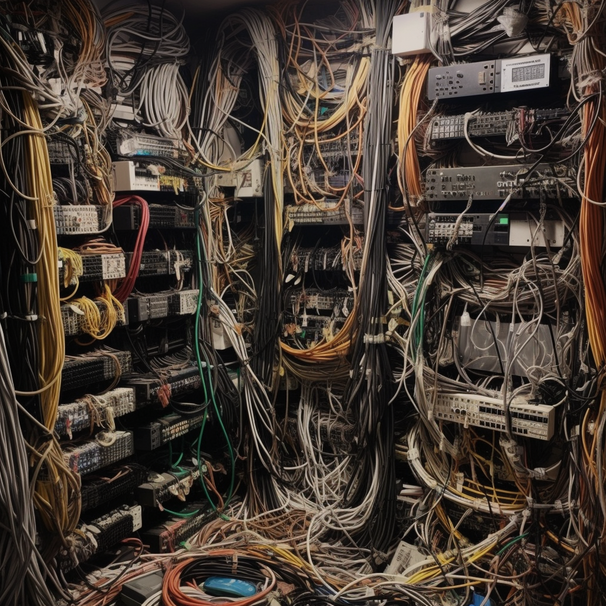
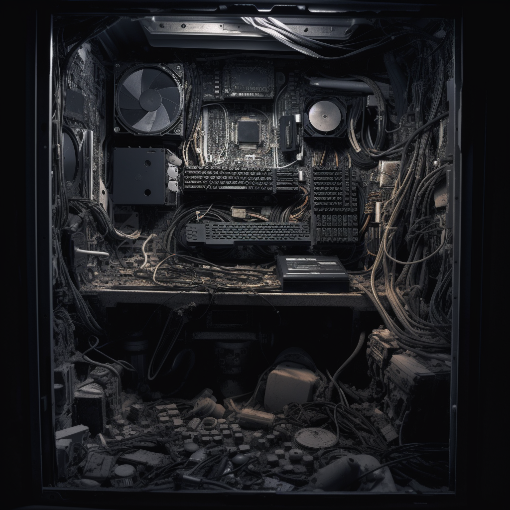

---
title: Why the internet is broken
subtitle: Money broke it
image: /assets/image/photo/2023/internet-graveyard.png
layout: post
--- 

### The internet is garbage
The internet is garbage. Nearly all of it is awful. There are still pockets of good all over the place but the overwhelming trend towards big tech platforms, trapping you in walled gardens and exerting monopolistic power is incredibly depressing. What started out as a utopian dream now seems much more like a dystopian vision. Black Mirror episodes that once seemed outlandish are now basically history lessons.  

It’s money. The relentless desire to monetise everything has pushed us down this road. For a good portion of Web 1.0 the internet was weirdly blasé about money. Services were generally free. People made stuff for the sake of it, out of interest or curiosity. 

### SEO has broken everything 
Nowadays it’s all plastered with ads. They’re everywhere. And the places that aren’t actively ramming autoplaying video ads down your throat are busy collecting data about what you’re interested in so they can sell it to someone else to force feed you ads. 

The inherent competition in selling ads (there’s only so much time anyone spends looking at the internet) means the push to be top of the search page heap and trample all your competitors is all consuming. SEO is a nightmare. Search engines are broken. Google is objectively much less useful for finding information on than it was a decade ago. Is this what progress looks like?

### Communities are harder to find
One of the real paradoxes of how the internet has changed over the last 15 years is how much harder social media has made it to find real communities. The relentless drive to make every platform bigger and to suck in more and more users has torn apart the many weird little communities that spent years just doing their own thing. I spent years on forums: music, film, food, books - niche little worlds where people chattered away. Reddit, twitter and Facebook are a poor alternative. All 3 are clearly ailing and beginning to fall apart but it’s not at all clear what replaces them. 

### AI is the next wave of awful
As if all this wasn’t enough, here comes GPT. Why wade through tonnes of lazily churned out SEO optimised copy when you could instead drown in gigatonnes of AI generated SEO optimised copy? This is the future and it doesn’t look like the search engines are ready for it. If you thought that finding information was hard now, just wait till 90% of it is AI ~~hallucinations~~ lies. 

### Human voices 
Unsurprisingly, I don’t have the answers to any of these problems. I’ve no idea how this is going to pan out. However it goes, though, I feel like the need for human voices, for recommendations, for curation, for selection, is only going to become more important. The AI generated playlists on Spotify are boring. The Netflix recommendation algorithm is terrible. And who’s going to trust an AI to review a restaurant? 

As we drown in a sea of algorithmically generated junk, it feels inevitable that we’re going to long for human voices. But will it be too late?

_All images generated with Midjourney (because of course they are!)_