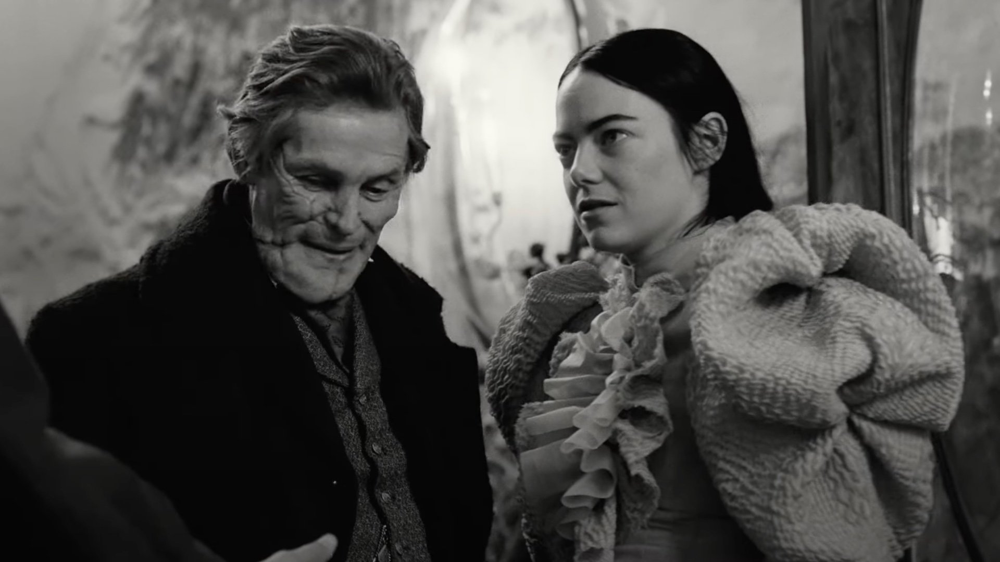

---
title: "Leeds International Film Festival 2023 Preview: Official Selection"
subtitle: It's go time!
image: /assets/image/photo/2023/liff-logo.png
layout: post
--- 

It's back. It's nearly November, and that means it's time to grab a copy of the film festival programme, a pencil and comfy chair. It's time to start picking out the films to get excited about. It's time to start working out quite how long it takes to get from the city centre up to the Hyde Park Picture House. It's time to buy some tickets!

The programme launch, with its compilation trailer reel shown on a big screen in Vue has whetted the appetite, so now I'm diving into the list of films and trying to work out what I can see. The plan here is to do a post on each of the major strands, taking a look at what I'm excited about. In this post, I'll start with the official selection. Let's go!

### Opening and Closing
The big name pictures that bookend the festival are reliably interesting. I'm definitely excited to see **_Poor Things_**, the latest from Yorgos Lanthimos. I've loved a lot of his films. _Dogtooth_ and _Alps_ are probably due a rewatch - I remember enjoying them, but not a lot about them. The trio that followed (_The Lobster_, _The Killing of a Sacred Deer_ and _The Favourite_) are all certified bangers. Each very different and bonkers in their own ways but utterly compelling. The trailer for _Poor Things_ looks pretty promising. A good pick for an opener.

All of which leaves closing film, **_Slow_**, with rather a hard act to follow. It sounds interesting enough but I'm not wildly excited about it. But I've misjudged a _lot_ of small romances in the past. Sometimes the films that look a little bit dull on paper turn out to be memorable worlds that drag you in. We'll see...

### The rest of the selection...
I'm not going to look at every film, so much as pick out a handful that are calling to me loudly. And there's a trio of films that are shouting the loudest. **_Anatomy of a Fall_**, Palme d'Or winner, looks like my kind of thriller. Meanwhile, **_Monster_** is the latest film from Hirokazu Kore-eda - I loved both _Shoplifters_ and _Broker_ (both at previous LIFF screenings!) so am very excited for this one. Rounding out my top three is **_Sultana's Dream_**: I din't know anything about the director or the source material (though a 1905 sci-fi feminist text certainly has me interested!) but the trailer was jaw-droppingly beautiful. 

After that, we move into a mix of the enjoyable, the interesting and the downright weird. Both **_The Queen of My Dreams_** and **_The Holdovers_** look pretty approachable. I don't think I'm expecting anything particularly new or exciting from either but they look like they could be sa lot of fun.

After that we've got **_All of Us Strangers_** (Andrew Scott in a relationship with Paul Mescal from _Aftersun_!), **_The Breaking Ice_** (I'm a sucker for a story about small lives in China) and **_Kiddo_** (a chaotic law-breaking mother-daughter road-trip). And my picks are rounded out by a couple of seriously weird looking choices: **_Chronicles of a Wandering Saint_** (staged miracles in an attempt to be more saintly than the other members of your church) and **_Sweet Dreams_** (a Dutch colonial tale set in Indonesia. The trailer looked _weird_).

### In short...
It's an exciting looking selection. The main strand can occasionally be a little bit earnest and heavy. This year though, there's a good mix and plenty that's calling me loudly. 

